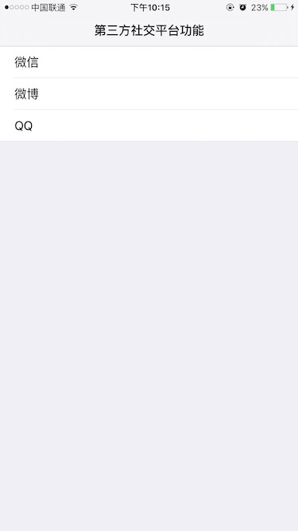
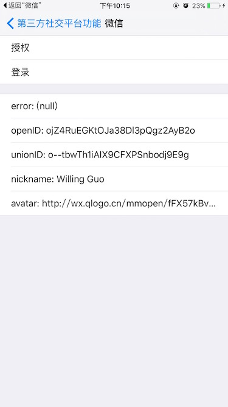
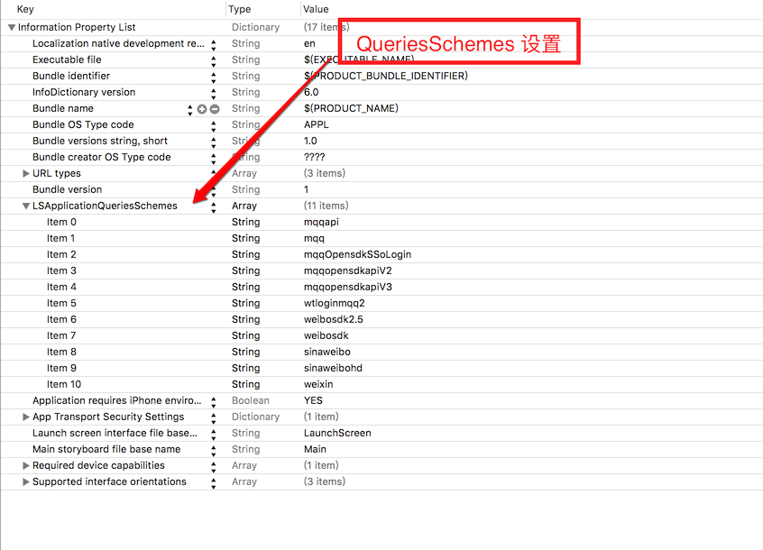
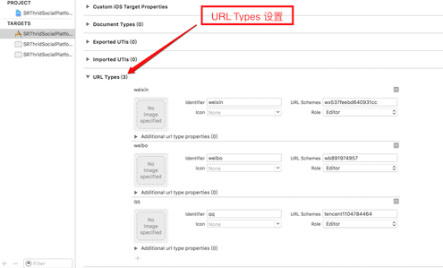

# SRThirdSocialPlatform

* **封装微信, 微博, QQ 第三方社交平台的登录授权功能, 通过 Block 的方式回调授权登录结果, 使用简单方便.**
* **实际项目开发中, 客户端只需拿到第三方平台的 code 或 token 即可, 所以可根据不同的业务需求, 自行修改代码.**

      

## Project settings

   

   

   

## Usage
**Initialize settings**

````objc
// Firstly registerApp through SRAuthManager when your app didFinishLaunching.
// Like this
- (BOOL)application:(UIApplication *)application didFinishLaunchingWithOptions:(NSDictionary *)launchOptions {
    // Override point for customization after application launch.
    
    [SRThirdSocialManager registerApp];
    
    return YES;
}
````

````objc
// Then handleOpenURL.
// Like this
- (BOOL)application:(UIApplication *)application handleOpenURL:(NSURL *)url {
    
    return [SRThirdSocialManager handleOpenURL:url];
}

- (BOOL)application:(UIApplication *)application openURL:(NSURL *)url sourceApplication:(NSString *)sourceApplication annotation:(id)annotation {
    
    return [SRThirdSocialManager handleOpenURL:url];
}

````

**That's all settings, you can use the third social platform's auth and login features.**

**Like this**

````objc
// Weixin auth
if ([SRThirdSocialManager isAppInstalled:SRThirdSocialWX]) {
    [SRThirdSocialManager authRequest:SRThirdSocialWX
                          authSuccess:^(NSString *openID, NSString *unionID) {
                              // Your code
                          } authError:^(NSError *error) {
                              // Your code
                          }];
}
    
// Weixin login
if ([SRThirdSocialManager isAppInstalled:SRThirdSocialWX]) {
    [SRThirdSocialManager loginRequest:SRThirdSocialWX
                          loginSuccess:^(NSString *openID, NSString *unionID, NSString *userNickname, NSString *userAvatarURL) {
                              // Your code
                          } loginError:^(NSError *error) {
                              // Your code
                          }];
}
````

````objc
// Weibo auth
if ([SRThirdSocialManager isAppInstalled:SRThirdSocialWB]) {
    [SRThirdSocialManager authRequest:SRThirdSocialWB
                          authSuccess:^(NSString *openID, NSString *unionID) {
                              // Your code
                          } authError:^(NSError *error) {
                              // Your code
                          }];
}
    
// Weibo login
if ([SRThirdSocialManager isAppInstalled:SRThirdSocialWB]) {
    [SRThirdSocialManager loginRequest:SRThirdSocialWB
                          loginSuccess:^(NSString *openID, NSString *unionID, NSString *userNickname, NSString *userAvatarURL) {
                              // Your code
                          } loginError:^(NSError *error) {
                              // Your code
                          }];
}
````

````objc
// QQ auth
if ([SRThirdSocialManager isAppInstalled:SRThirdSocialQQ]) {
    [SRThirdSocialManager authRequest:SRThirdSocialQQ
                          authSuccess:^(NSString *openID, NSString *unionID) {
                              // Your code
                          } authError:^(NSError *error) {
                              // Your code
                          }];
}
    
// QQ login
if ([SRThirdSocialManager isAppInstalled:SRThirdSocialQQ]) {
    [SRThirdSocialManager loginRequest:SRThirdSocialQQ
                          loginSuccess:^(NSString *openID, NSString *unionID, NSString *userNickname, NSString *userAvatarURL) {
                              // Your code
                          } loginError:^(NSError *error) {
                              // Your code
                          }];
}
````

**More information please see the source code.**   

**If you have any question, please issue or contact me.**   

**If you like it, please star me, thanks a lot.**

**Have Fun.**