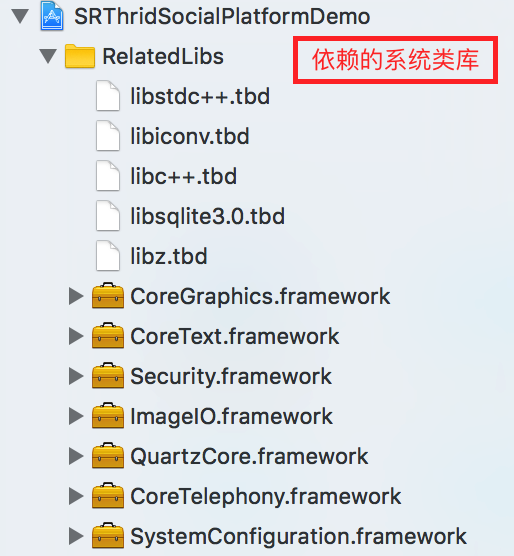

# SRThirdSocialPlatform

封装微信, 微博, QQ 第三方社交平台的登录授权功能, 通过 Block 的方式回调授权登录结果, 使用简单方便. 实际项目开发中, 客户端只需拿到第三方平台的 code 或 token 即可, 所以可根据不同的业务需求, 自行修改代码.

## Screenshots

  

## Project Settings

   

   

   

## APIs

````objc
typedef NS_OPTIONS (NSInteger, SRThirdSocialType) {
    SRThirdSocialWX = 1 << 0,
    SRThirdSocialWB = 1 << 1,
    SRThirdSocialQQ = 1 << 2,
};

typedef void (^SRThirdSocialAuthSuccess)(NSString *openID, NSString *unionID);
typedef void (^SRThirdSocialAuthError)(NSError *error);

typedef void (^SRThirdSocialLoginSuccess)(NSString *openID, NSString *unionID, NSString *userNickname, NSString *userAvatarURL);
typedef void (^SRThirdSocialLoginError)(NSError *error);

@interface SRThirdSocialManager : NSObject

+ (void)registerApp;

+ (BOOL)isAppInstalled:(SRThirdSocialType)thirdSocialType;

+ (void)installeAPP:(SRThirdSocialType)thirdSocialType;

+ (BOOL)handleOpenURL:(NSURL *)aURL;

+ (void)authRequest:(SRThirdSocialType)thirdSocialType authSuccess:(SRThirdSocialAuthSuccess)authSuccess authError:(SRThirdSocialAuthError)authError;

+ (void)loginRequest:(SRThirdSocialType)thirdSocialType loginSuccess:(SRThirdSocialLoginSuccess)loginSuccess loginError:(SRThirdSocialLoginError)loginError;
````

## Usage

````objc
- (BOOL)application:(UIApplication *)application didFinishLaunchingWithOptions:(NSDictionary *)launchOptions {
    // Override point for customization after application launch.
    
    [SRThirdSocialManager registerApp]; // registerApp through SRAuthManager when your app didFinishLaunching
    
    return YES;
}
````

````objc
- (BOOL)application:(UIApplication *)application handleOpenURL:(NSURL *)url {
    return [SRThirdSocialManager handleOpenURL:url]; // handleOpenURL
}

- (BOOL)application:(UIApplication *)application openURL:(NSURL *)url sourceApplication:(NSString *)sourceApplication annotation:(id)annotation {
    return [SRThirdSocialManager handleOpenURL:url]; // handleOpenURL
}
````

````objc
// WX Auth
if ([SRThirdSocialManager isAppInstalled:SRThirdSocialWX]) {
    [SRThirdSocialManager authRequest:SRThirdSocialWX
                          authSuccess:^(NSString *openID, NSString *unionID) {
                              // your code
                          } authError:^(NSError *error) {
                              // your code
                          }];
}
    
// WX Login
if ([SRThirdSocialManager isAppInstalled:SRThirdSocialWX]) {
    [SRThirdSocialManager loginRequest:SRThirdSocialWX
                          loginSuccess:^(NSString *openID, NSString *unionID, NSString *userNickname, NSString *userAvatarURL) {
                              // your code
                          } loginError:^(NSError *error) {
                              // your code
                          }];
}
````

````objc
// WB Auth
if ([SRThirdSocialManager isAppInstalled:SRThirdSocialWB]) {
    [SRThirdSocialManager authRequest:SRThirdSocialWB
                          authSuccess:^(NSString *openID, NSString *unionID) {
                              // your code
                          } authError:^(NSError *error) {
                              // your code
                          }];
}
    
// WB Login
if ([SRThirdSocialManager isAppInstalled:SRThirdSocialWB]) {
    [SRThirdSocialManager loginRequest:SRThirdSocialWB
                          loginSuccess:^(NSString *openID, NSString *unionID, NSString *userNickname, NSString *userAvatarURL) {
                              // your code
                          } loginError:^(NSError *error) {
                              // your code
                          }];
}
````

````objc
// QQ Auth
if ([SRThirdSocialManager isAppInstalled:SRThirdSocialQQ]) {
    [SRThirdSocialManager authRequest:SRThirdSocialQQ
                          authSuccess:^(NSString *openID, NSString *unionID) {
                              // your code
                          } authError:^(NSError *error) {
                              // your code
                          }];
}
    
// QQ Login
if ([SRThirdSocialManager isAppInstalled:SRThirdSocialQQ]) {
    [SRThirdSocialManager loginRequest:SRThirdSocialQQ
                          loginSuccess:^(NSString *openID, NSString *unionID, NSString *userNickname, NSString *userAvatarURL) {
                              // your code
                          } loginError:^(NSError *error) {
                              // your code
                          }];
}
````